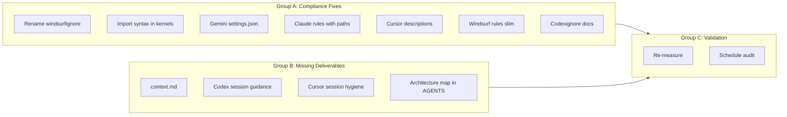

# Context Engineering & Token Management -- Unified Completion Plan

## Status: What's Done vs. What Remains

The original Balanced Plan (Phases 1-4) was ~80% executed. The Compliance Audit then identified 8 gaps against official 2026 docs. This unified plan consolidates **all remaining items** from both plans under the original vision: maximizing signal-per-token across all 5 IDEs.

### Completed (no action needed)

- Phase 1: Baseline measurement, ignore files (`.cursorignore`, `.claudeignore`, `.geminiignore`, `.codexignore`)
- Phase 2: `docs/standards/` modules (7 files: rust, git, routing, testing, security, solid, oop)
- Phase 2: Kernel slimming (AGENTS.md 47 lines, CLAUDE.md 28 lines, GEMINI.md 15 lines)
- Phase 2: Cursor rule tiering (guardrails always-on, task-routing/testing/solid/oop agent-requested)
- Phase 3: Claude Code hooks (`pre-compact.sh` with plan retention, `pre-tool-gate.sh` with kernel edit warning)
- Phase 3: Gemini hook (`.gemini/hooks/pre-compress.sh`)
- Phase 3: Git hook (`scripts/git-hooks/check-kernel-size.sh`)
- Phase 3: `.windsurfrules` created (12 lines, memory/task directives)

---

## Remaining Work (3 Groups)

### Group A: Compliance Fixes (from Audit Gaps 1-8)

These fix things that were built incorrectly or incompletely relative to official docs.

**A1. Rename `.windsurfignore` to `.codeiumignore`** (Gap 1)

- Windsurf reads `.codeiumignore`, not `.windsurfignore`. Current file is inert.
- Action: `mv .windsurfignore .codeiumignore`

**A2. Use native `@import` syntax in kernel files** (Gaps 2, 4)

- [CLAUDE.md](CLAUDE.md): Replace `Read AGENTS.md first.` with `@AGENTS.md` (auto-inlines at launch)
- [GEMINI.md](GEMINI.md): Replace `Read AGENTS.md first.` with `@AGENTS.md`
- Source: Anthropic docs (`@path/to/import` syntax), Gemini CLI docs (`@file.md` syntax)

**A3. Add AGENTS.md to Gemini `settings.json` context** (Gap 3)

- Add `"context": { "fileName": ["AGENTS.md", "GEMINI.md"] }` to [.gemini/settings.json](.gemini/settings.json)
- This makes Gemini auto-discover AGENTS.md without relying on the `@import`

**A4. Create `.claude/rules/` with path-scoped rules** (Gap 5)

- `.claude/rules/rust-standards.md` with `paths: ["src/**/*.rs"]` frontmatter
- `.claude/rules/testing.md` with `paths: ["tests/**/*.rs"]` frontmatter
- Content mirrors the lean Cursor `.mdc` equivalents, not the full `docs/standards/` files
- This gives Claude Code the same "load only when relevant" behavior that Cursor has

**A5. Improve Cursor "Apply Intelligently" descriptions** (Gap 6)

- Community reports unreliable activation. Improve `description` fields in:
  - [.cursor/rules/testing-standards.mdc](.cursor/rules/testing-standards.mdc)
  - [.cursor/rules/solid-principles.mdc](.cursor/rules/solid-principles.mdc)
  - [.cursor/rules/oop-best-practices.mdc](.cursor/rules/oop-best-practices.mdc)
  - [.cursor/rules/task-routing.mdc](.cursor/rules/task-routing.mdc)
- Make descriptions action-trigger oriented: "Apply when writing tests or reviewing test files" rather than generic

**A6. Update `.windsurf/rules/` to match slimmed content** (Gap 7)

- [.windsurf/rules/agent-guardrails.md](.windsurf/rules/agent-guardrails.md) still has pre-optimization content (session handoff, qmd sync, git standards that belong in `docs/standards/`)
- [.windsurf/rules/rust-standards.md](.windsurf/rules/rust-standards.md) looks lean already but verify alignment
- Slim `agent-guardrails.md` to match Cursor's lean version: three-tier boundaries, escalation, large-file discipline

**A7. Document `.codexignore` status** (Gap 8)

- `.codexignore` is likely inert (no official docs support it). Keep file (no harm), add a comment at the top: `# Note: Codex CLI may not read this file. Context exclusion is via sandbox config.`

### Group B: Missing Deliverables (from Original Balanced Plan)

These were in the original plan but never executed.

**B1. Create `docs/standards/context.md`** (Phase 3c)

- User-facing context engineering best practices document covering:
  - Artifact-driven state: decisions in `plans/`, not chat history
  - Session discipline: one feature per session, new chat when changing domain
  - Request scoping: `"fix src/db.rs line 42"` vs `"fix the database bug"`
  - Use `@filename` not `@Codebase` in Cursor/Windsurf
  - Prompt caching: don't edit kernel files mid-session
  - Compaction as fallback, not primary strategy

**B2. Codex session guidance** (Phase 3a)

- No `CODEX_INSTRUCTIONS.md` or session guidance exists
- `.codex/config.yaml` exists but only has MCP server config
- Action: Create a `CODEX.md` at project root (Codex reads `AGENTS.md` but also supports project-level docs)
- Content: Short session discipline guidance -- prefer short sessions, limit compactions to 1-2 per session, commit and restart rather than compact repeatedly

**B3. Add session hygiene hint to Cursor guardrails** (Phase 3a)

- [.cursor/rules/agent-guardrails.mdc](.cursor/rules/agent-guardrails.mdc) is missing: "After completing a task and committing, suggest starting a new chat."
- One line addition

**B4. Restore architecture map in AGENTS.md** (Phase 2b)

- The original plan stated AGENTS.md should keep the `src/` tree architecture map
- It was dropped during slimming (current 47 lines has no architecture section)
- Add back the 7-line `src/` tree:

```
## Architecture
src/
 main.rs    -- CLI entry (clap), tokio bootstrap
 tracker.rs -- Core tracking loop, active window polling
 sys_info.rs -- System info (sysinfo crate)
 db.rs      -- SQLite persistence (rusqlite)
```

### Group C: Validation & Ongoing (Phase 4)

**C1. Post-fix measurement**

- After Groups A+B, re-count always-on lines per IDE and compare to pre-optimization baseline
- Verification checklist from original plan:
  - Always-on context reduced by at least 40%
  - `.cursorignore` prevents indexing of `target/`, `Cargo.lock`
  - Open Cursor on `.rs` file -- only lean guardrails + security injected
  - Edit AGENTS.md in Claude Code -- hook warns
  - Compact Claude Code session -- `pre-compact.sh` retains plan references
  - Security rules loaded on every prompt in every IDE
  - Agents can find `docs/standards/testing.md` when writing tests

**C2. Schedule ignore file audit** (Phase 1b follow-up)

- Original plan called for auditing ignore files after 2 weeks
- Add a reminder/note to `docs/standards/context.md` or a TODO in the plan

**C3. Ongoing monitoring** (Phase 4b/c)

- After 1-2 weeks: check for quality regressions, missed standards, unused Tier 2 rules
- Adjust kernel size thresholds, promote/demote rules based on real usage

---

## Execution Order

Groups A and B can be done in parallel as they touch different files. Group C follows after A+B are complete.




## Files Affected (Summary)

- **Rename**: `.windsurfignore` -> `.codeiumignore`
- **Edit**: `CLAUDE.md`, `GEMINI.md`, `AGENTS.md`, `.gemini/settings.json`
- **Edit**: `.cursor/rules/testing-standards.mdc`, `.cursor/rules/solid-principles.mdc`, `.cursor/rules/oop-best-practices.mdc`, `.cursor/rules/task-routing.mdc`
- **Edit**: `.windsurf/rules/agent-guardrails.md`
- **Edit**: `.cursor/rules/agent-guardrails.mdc`
- **Edit**: `.codexignore` (add comment)
- **Create**: `.claude/rules/rust-standards.md`, `.claude/rules/testing.md`
- **Create**: `docs/standards/context.md`
- **Create**: `CODEX.md`

