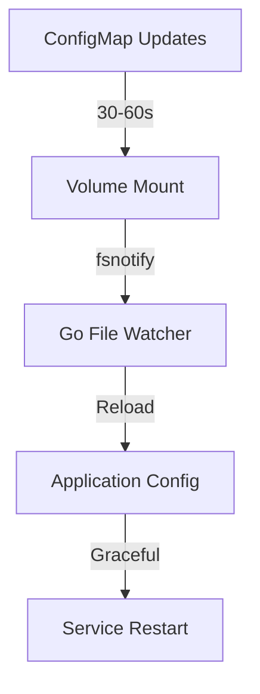
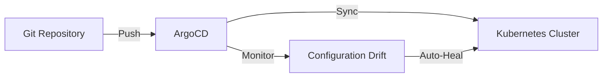
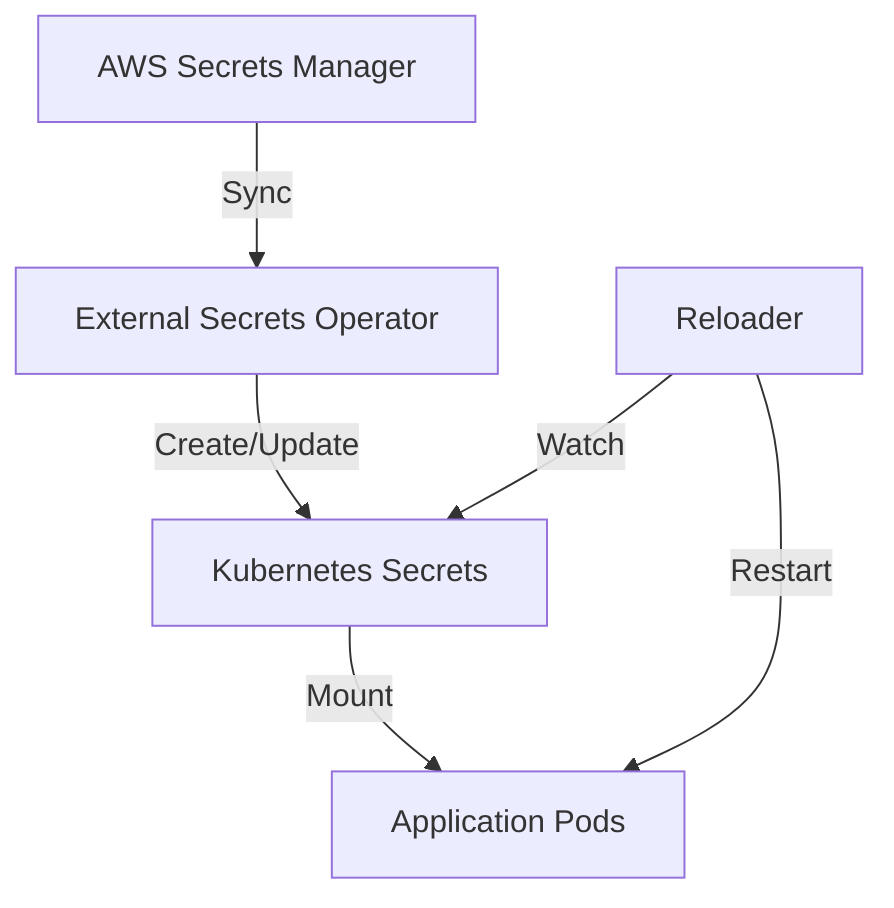
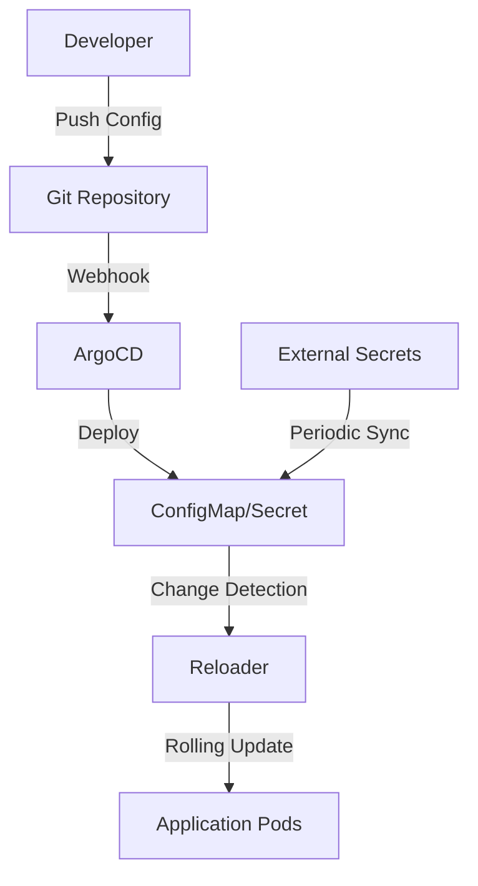

# Kubernetes Configuration Management Modernization Plan

## Current State Analysis

The AUC conversion application currently uses:

- **Environment-based config**: `github.com/sethvargo/go-envconfig` for runtime configuration
- **Static manifests**: Operational K8s manifests in `[deploy/k8s/](deploy/k8s/)` and Kustomize overlays in `[docs/analysis/data-conversion/k8s/](docs/analysis/data-conversion/k8s/)`
- **Manual config management**: No automated config reloading or GitOps workflow

## 1. Hot Reload Implementation

### Application-Level Hot Reload

Implement configuration hot reload in the Go application using file watchers:




**Key Changes:**

- Add `[fsnotify](https://github.com/fsnotify/fsnotify)` dependency to both `[cmd/api/main.go](cmd/api/main.go)` and `[cmd/conversion-worker/main.go](cmd/conversion-worker/main.go)`
- Create `config/hotreload.go` module to watch `/etc/config` directory
- Modify `[config/config.go](config/config.go)` to support dynamic reloading
- Update Dockerfiles to include config volume mount points

### Pod-Level Automated Restarts

Deploy Stakater Reloader for automatic pod restarts when ConfigMaps change:

- Install Reloader operator in cluster
- Add `reloader.stakater.com/auto: "true"` annotations to existing deployments
- ConfigMap/Secret changes trigger automatic rolling updates

## 2. Convention Over Configuration Architecture

### GitOps with ArgoCD

Implement declarative configuration management:




**Repository Structure:**

```
config/
├── base/                           # Base Kustomize configuration
│   ├── kustomization.yaml
│   ├── deployment.yaml
│   ├── configmap.yaml
│   └── service.yaml
├── overlays/
│   ├── development/
│   ├── staging/
│   └── production/
└── argocd/
    ├── applications/
    └── projects/
```

### Kustomize-First Approach

Consolidate existing manifests using Kustomize overlays:

- Migrate operational `[deploy/k8s/](deploy/k8s/)` manifests to Kustomize base
- Create environment-specific overlays (dev/staging/prod)
- Use built-in ConfigMap/Secret generators with hash suffixes for automatic rollouts

## 3. External Configuration Management

### External Secrets Integration

Deploy External Secrets Operator for automated secret synchronization:




**Implementation:**

- Deploy External Secrets Operator
- Configure `SecretStore` for AWS Secrets Manager integration
- Create `ExternalSecret` resources for database credentials, API keys
- Automatic secret rotation and pod restart capabilities

### Dynamic Configuration Sources

Enhance configuration flexibility beyond environment variables:

- **ConfigMap volumes** for application settings that need hot reload
- **Secret volumes** for sensitive configuration (DB connections, API keys)
- **Excel file ConfigMaps** for conversion mapping rules with hot reload
- **Database-driven config** with periodic refresh mechanisms

## 4. Automation and Reduced Manual Work

### Automated Configuration Pipeline




### Configuration Validation

- **OPA/Gatekeeper policies** for configuration validation
- **Config schema validation** in CI/CD pipeline
- **Drift detection** and automatic remediation

### Monitoring and Observability

- **ConfigMap/Secret change alerts** via Prometheus metrics
- **Configuration reload success/failure tracking**
- **Application health checks** post-configuration changes

## 5. Implementation Strategy

### Phase 1: Hot Reload Foundation

- Implement Go file watcher for configuration hot reload
- Deploy Reloader operator for automated pod restarts
- Update existing `[deploy/k8s/worker-deployment.yaml](deploy/k8s/worker-deployment.yaml)` with Reloader annotations

### Phase 2: GitOps Implementation

- Set up ArgoCD in cluster
- Migrate existing K8s manifests to Kustomize structure
- Implement environment-specific configuration overlays

### Phase 3: External Configuration

- Deploy and configure External Secrets Operator
- Migrate sensitive configuration to AWS Secrets Manager
- Implement automated secret rotation

### Phase 4: Advanced Automation

- Add configuration validation policies
- Implement comprehensive monitoring and alerting
- Optimize for zero-downtime configuration changes

## Benefits

- **Zero-downtime configuration updates** through hot reload
- **Reduced manual configuration** via GitOps automation
- **Improved security** through external secret management
- **Environment consistency** through convention-based overlays
- **Automated drift correction** and configuration validation

