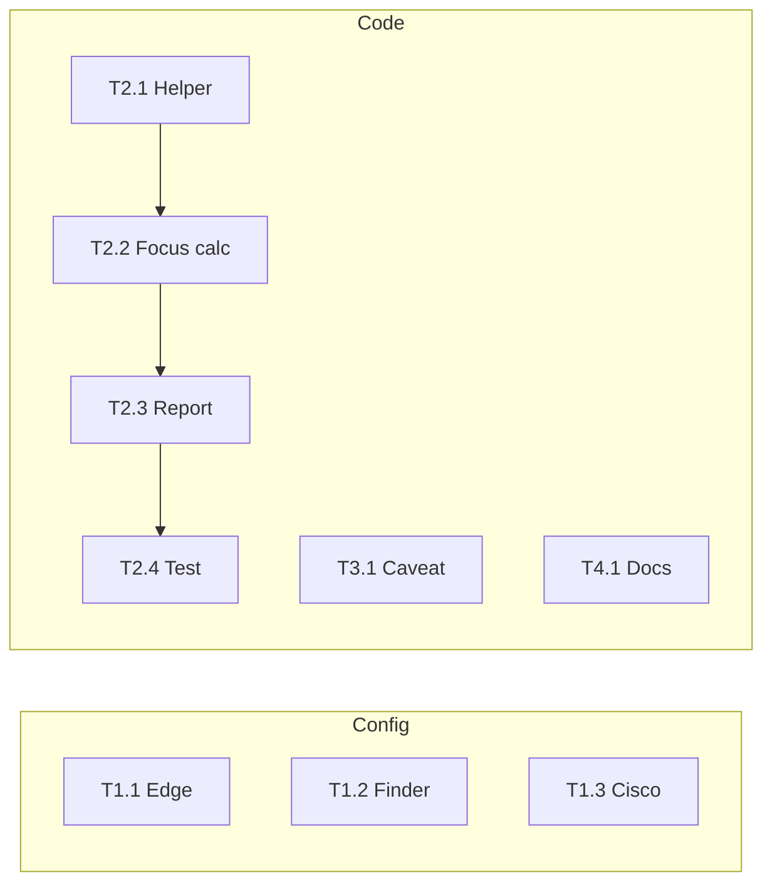

# Task Plan: Report Output Recommended Changes

Tasks are grouped by area. Config work is independent; code work has a suggested order.

---

## Area 1: Config — Reduce Uncategorized (rules)

**Goal:** Add productivity rules so Microsoft Edge, Finder, and Cisco Secure Client are classified; re-running `activtrak report --today` should show lower Uncategorized %.

| Task     | Description                                                                                                                                                                                                                                                                                                                                      | Verification                                                               |
| -------- | ------------------------------------------------------------------------------------------------------------------------------------------------------------------------------------------------------------------------------------------------------------------------------------------------------------------------------------------------ | -------------------------------------------------------------------------- |
| **T1.1** | Add rule(s) for **Microsoft Edge** in [productivity_rules.toml](productivity_rules.toml). Option A: single rule `match_executable = "Microsoft Edge"` with status Passive (or Productive Active if work-only). Option B: title-based rules for work sites (e.g. Azure DevOps, GitHub) as Productive Active + one catch-all Edge rule as Passive. | Run report; Edge time appears as Passive or Productive, not Uncategorized. |
| **T1.2** | Add rule for **Finder** (e.g. `match_executable = "Finder"`, status Passive) if desired.                                                                                                                                                                                                                                                         | Report shows Finder as Passive or leave uncategorized per preference.      |
| **T1.3** | Add rule for **Cisco Secure Client** (e.g. `match_executable = "Cisco Secure Client"`, status Passive).                                                                                                                                                                                                                                          | Report shows Cisco as Passive.                                             |

**Note:** Exact executable names must match what the tracker records (e.g. "Microsoft Edge" vs "Edge"). Check existing activity or run tracker briefly and inspect `activity_log` / summary to confirm names.

---

## Area 2: Code — Recompute focus in report (optional)

**Goal:** When printing the today report, optionally compute focus score from **current** raw activity + reclassified productivity so the displayed score reflects the latest data even if the tracker has not flushed recently.

| Task     | Description                                                                                                                                                                                                                                                                                                                                                                                                                                                             | Dependencies | Verification                                                                                |
| -------- | ----------------------------------------------------------------------------------------------------------------------------------------------------------------------------------------------------------------------------------------------------------------------------------------------------------------------------------------------------------------------------------------------------------------------------------------------------------------------- | ------------ | ------------------------------------------------------------------------------------------- |
| **T2.1** | In [main.rs](src/main.rs), add a helper that, given today’s raw activity records and the current `RuleSet`, computes: total_tracked_minutes, productive_minutes (from reclassify logic), and uses existing DB or in-memory switch/deep-work data if available.                                                                                                                                                                                                          | None         | Helper returns correct totals and productive minutes for a small test dataset.              |
| **T2.2** | Use [FocusScoreCalculator](src/insights/focus_score.rs) with config weights and `FocusScoreInput` built from: (a) deep_work_minutes / total_tracked_minutes from stored daily_metrics or from recomputed session list, (b) switches_per_hour from stored metrics or from activity (if we have switch timestamps in DB). Prefer reusing stored `switches_per_hour` and `deep_work_minutes` when present and only recomputing productive ratio from `reclassify_today`.   | T2.1         | Focus score recomputed matches expectation for known inputs.                                |
| **T2.3** | In `print_today_report`, after loading `metrics` from `get_daily_metrics_today`: compute productive_secs (and total_secs) via existing `reclassify_today`; build productive_minutes; optionally recompute focus using stored deep_work_minutes and switches_per_hour and new productive_minutes; display this “live” focus score (and optionally label it e.g. “Focus Score (recomputed)” or keep single “Focus Score” and document that it uses current productivity). | T2.2         | Report shows focus that reflects current 65% productive when metrics were previously stale. |
| **T2.4** | Add a unit or integration test: seed DB with short session (e.g. 5 min productive, 2 min uncategorized), run report, assert recomputed focus is > 0 when productive ratio is high and switch rate is low.                                                                                                                                                                                                                                                               | T2.3         | CI passes.                                                                                  |

**Risks:** Deep work and switches_per_hour are only in daily_metrics (written by tracker). For a “recomputed” score we can either (i) use stored deep_work_minutes and switches_per_hour and only replace productive_minutes with reclassify_today output, or (ii) derive switches from raw activity (e.g. count window changes) if that data is available. (i) is simpler and already improves the report when productive ratio was wrong or stale.)

---

## Area 3: Code — Short-session caveat (optional)

**Goal:** When total tracked time today is very short, show a one-line note so users do not over-interpret focus/switches per hour.

| Task     | Description                                                                                                                                                                                                                                                                                               | Dependencies | Verification                                                        |
| -------- | --------------------------------------------------------------------------------------------------------------------------------------------------------------------------------------------------------------------------------------------------------------------------------------------------------- | ------------ | ------------------------------------------------------------------- |
| **T3.1** | In `print_today_report`, after the executable table, compute total tracked seconds for today (e.g. from `get_summary_today` sum or from raw activity). If total < threshold (e.g. 300 sec = 5 min), print a line such as: “Note: Focus and switches/hr are based on a short session and may be volatile.” | None         | For a DB with < 5 min data, note appears; for > 5 min, it does not. |
| **T3.2** | Make threshold configurable (e.g. in [config](src/config.rs) under report or display) or keep as a constant in main.rs with a comment.                                                                                                                                                                    | Optional     | Config or constant documented.                                      |

---

## Area 4: Docs (optional)

**Goal:** Document where report numbers come from so users and agents understand Focus vs Productivity.

| Task     | Description                                                                                                                                                                                                                                                                                                                               | Verification                                             |
| -------- | ----------------------------------------------------------------------------------------------------------------------------------------------------------------------------------------------------------------------------------------------------------------------------------------------------------------------------------------- | -------------------------------------------------------- |
| **T4.1** | In [AGENTS.md](AGENTS.md) or a new `docs/report-metrics.md`, add a short section: “Report `--today` metrics: Focus Score, Deep Work, and Switches come from the last tracker flush (daily_metrics). Productivity % is recomputed from current rules on raw activity. Running the tracker longer improves reliability of focus/deep work.” | Section exists and is linked or visible to contributors. |

---

## Suggested execution order

- **Parallel:** Area 1 (T1.1–T1.3), Area 3 (T3.1–T3.2), Area 4 (T4.1) can be done in parallel with each other and with Area 2.
- **Sequential within Area 2:** T2.1 → T2.2 → T2.3 → T2.4.

---

## Done criteria (per area)

- **Area 1:** `activtrak report --today` shows Edge/Finder/Cisco as non-uncategorized (or intentional Uncategorized for Finder).
- **Area 2:** Report shows a focus score that uses current productivity share; test added and passing; `cargo clippy` and `cargo test` pass.
- **Area 3:** Short-session note appears when tracked time < 5 min; otherwise not.
- **Area 4:** AGENTS.md or docs/report-metrics.md updated and accurate.

